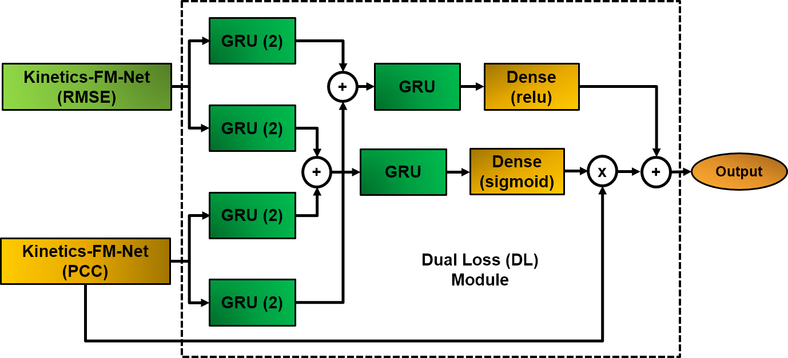
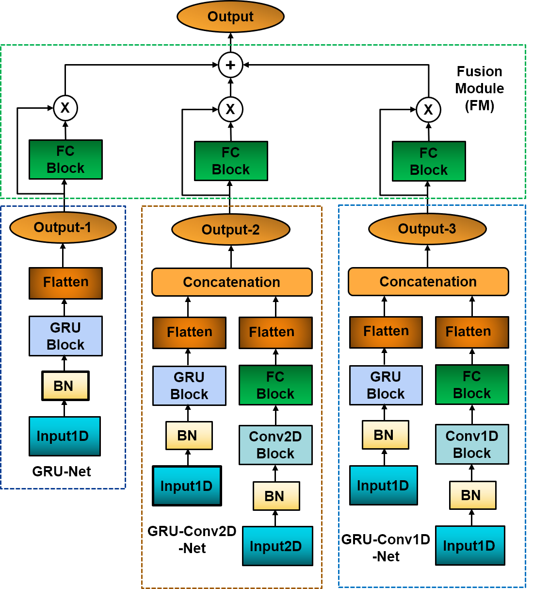

#  Estimation of Hip, Knee, and Ankle Joint Moment Using a Single IMU Sensor on Foot Via Deep Learning
By: Md Sanzid Bin Hossain, Zhishan Guo, Hwan Choi

## Summary

This repository contains the code for **DL-Kinetics-FM-Net**, a novel deep-learning model designed to estimate hip, knee, and ankle joint moments in the sagittal plane using data from a single IMU sensor placed on the foot. Traditional methods for analyzing joint moments are constrained to lab environments, requiring expensive and cumbersome equipment such as force plates, motion capture cameras, and pressure sensors. DL-Kinetics-FM-Net aims to overcome these limitations by enabling joint moment estimation in real-world settings, including treadmill, level-ground, ramp, and stair walking conditions.


<p align="center">
  
  <br>
  <em>Figure 1: Overview of the DL-Kinetics-FM-Net architecture</em>
</p>

<p align="center">
  
  <br>
  <em>Figure 2: Overview of the Kinetics-FM-Net architecture</em>
</p>


### Key Features
- **End-to-End Training**: DL-Kinetics-FM-Net is trained as a complete system to maximize performance.
- **Fusion Module (FM)**: A novel component that enhances the estimation of joint moments by integrating multiple data streams.
- **Improved Loss Function Design**: Incorporates two loss functions more efficiently than conventional approaches, leading to superior estimation accuracy.

### Performance
In comprehensive evaluations, DL-Kinetics-FM-Net achieves a significant reduction in normalized root mean square error (NRMSE) by **7.10% to 23.16%** compared to the current state-of-the-art methods. This model provides a more accessible and cost-effective solution for estimating joint moments in daily walking scenarios, with minimal sensor requirements.

---

## Data

- Data for initial implementation can be accessed from the [Google Drive](https://drive.google.com/drive/folders/16UA4C2zR-4kOQIyLNUUEiWohwOfMg6N8?usp=sharing)
- Data for the [updated implementation](IEEE_CHASE_Kinetics_dataset_A_Estimation.ipynb) can be found in the following [google drive](https://drive.google.com/file/d/1M5MuftWOePwqjFDeyvQkXpT80dcgUfhk/view?usp=sharing)

## Codes 

- Updated jupyter notebook for this instance can be found in this [link](IEEE_CHASE_Kinetics_dataset_A_Estimation.ipynb)
- Previous codes used to run the models can be found in the [Codes folder](Codes)

## Citation
If you use this model or dataset in your research, please cite the following paper:

```bibtex
@inproceedings{hossain2022estimation,
  title={Estimation of Hip, Knee, and Ankle Joint Moment Using a Single IMU Sensor on Foot Via Deep Learning},
  author={Hossain, Md Sanzid Bin and Guo, Zhishan and Choi, Hwan},
  booktitle={2022 IEEE/ACM Conference on Connected Health: Applications, Systems and Engineering Technologies (CHASE)},
  pages={25--33},
  year={2022},
  organization={IEEE}
}
